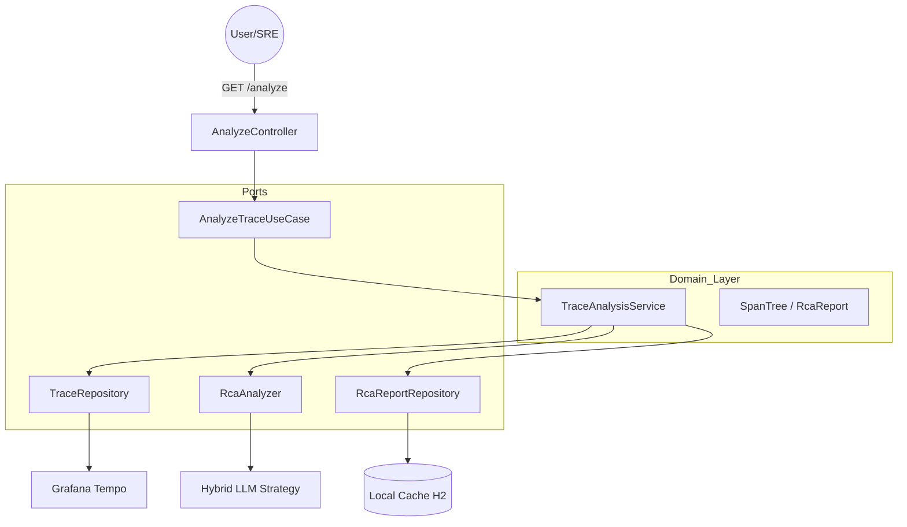

# RCA Agent

> AI agent that automates Root Cause Analysis on distributed traces.
> Receives a `trace_id`, fetches the complete span tree from Grafana Tempo,
> correlates with Prometheus metrics, compares against historical baseline,
> and produces structured RCA reports using LangChain4j with a hybrid LLM strategy.

[](https://openjdk.org/projects/jdk/21/)
[](https://kotlinlang.org/)
[](https://spring.io/projects/spring-boot)
[](https://opentelemetry.io/)
[](https://github.com/kaeron-dev/rca-agent/actions)
[](LICENSE)

---

## What it does

Instead of manually inspecting traces in Grafana, you send a single request:

```bash
curl -X GET http://localhost:8080/api/analyze/{trace_id}
```

And get back a structured report:

```json
{
    "traceId": "4518f5a66654f47eb21cf074bbd6015f",
    "rootCause": "Slow SQL execution on payments table (2x baseline)",
    "anomalySpan": "POST /orders",
    "durationMs": 3074,
    "baselineMs": 250,
    "anomalyFactor": 12.296,
    "recommendation": "Add index on transaction_id in order-service",
    "confidence": 0.9,
    "anomalyType": "DATABASE_SLOW_QUERY",
    "highConfidence": true,
    "anomaly": true
}
```

---

## High-Level Architecture

The agent follows a strict **Hexagonal Architecture** (Ports & Adapters) to decouple business logic from infrastructure (Tempo, Prometheus, LLMs).



---

## Key Features (Production Grade)

### 1. Hybrid Resilience LLM Strategy
The agent uses a **"Survival First"** strategy for inference:
*   **Main Model**: Attempts cloud inference via **Gemini Flash** (Fast & Free Tier).
*   **Intelligent Fallback**: If Gemini fails (429 Quota Exceeded), it instantly switches to **Local Ollama** (Llama 3.2).
*   **Quota Memory**: After a quota error, it skips Gemini for 60s to avoid unnecessary network lag.
*   **Inference Semaphore**: Limits concurrent AI calls to prevent CPU saturation on local hardware.

### 2. Smart Persistence (Cache-Aside)
Analyses are **immutable and persistent**. The system checks the local database (H2) before calling the AI.
*   **Deterministic**: Same traceId always returns the same diagnosis.
*   **Fast**: Cached results return in <10ms vs 30s+ for AI inference.
*   **Quality Gated**: Only high-confidence reports (>= 0.7) are stored in the permanent cache.

### 3. Eventual Consistency Handling
Tracing backends like Tempo are asynchronously indexed. The agent implements **Smart Polling**:
*   If a trace is "shallow" (missing spans), it retries up to 5 times with exponential backoff.
*   It waits until the **Ground Zero** anomaly is visible before generating the report.

---

## Stack

| Component | Technology | Version |
|---|---|---|
| RCA Agent | Java 21 + LangChain4j | 21 LTS |
| Microservices | Kotlin + Spring Boot | 2.0.21 / 3.3.5 |
| Messaging | Apache Kafka (KRaft) | 7.7.0 |
| Storage | H2 (Persistence) / Tempo (Traces) | — |
| LLM | Gemini Flash / Ollama (Llama 3.2) | — |

---

## Setup & Demo

### 1. Initial Configuration
Before starting the stack, you must create your local environment file:
```bash
cp .env.example .env
```
Edit the `.env` file and provide your **GEMINI_API_KEY** if you wish to use the cloud model. By default, the system is configured to use **Ollama** (local).

### 2. Start the Stack
```bash
# Start all services (Tempo, Prometheus, Ollama, Kafka, Services)
docker compose up -d
```

### 2. Run Automated Demo
The demo injects a database anomaly, captures the trace, and calls the agent:
```bash
./scripts/demo.sh
```

---

## Production Roadmap ✅

| Feature | Status | Architecture Decision |
|---|---|---|
| **Tempo Integration** | ✅ | Smart polling for eventual consistency |
| **LLM Resilience** | ✅ | Automatic fallback Gemini -> Ollama |
| **Caching Layer** | ✅ | Hexagonal persistence for immutable reports |
| **Post-Processing** | ✅ | Heuristic inference for anomaly types |
| **CI/CD Pipeline** | ✅ | GitHub Actions for build & test |

---

## License
MIT — see [LICENSE](LICENSE)
