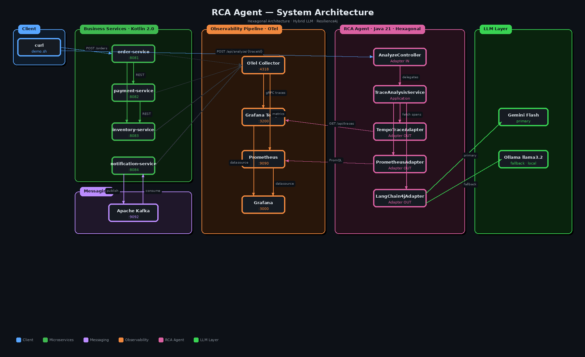
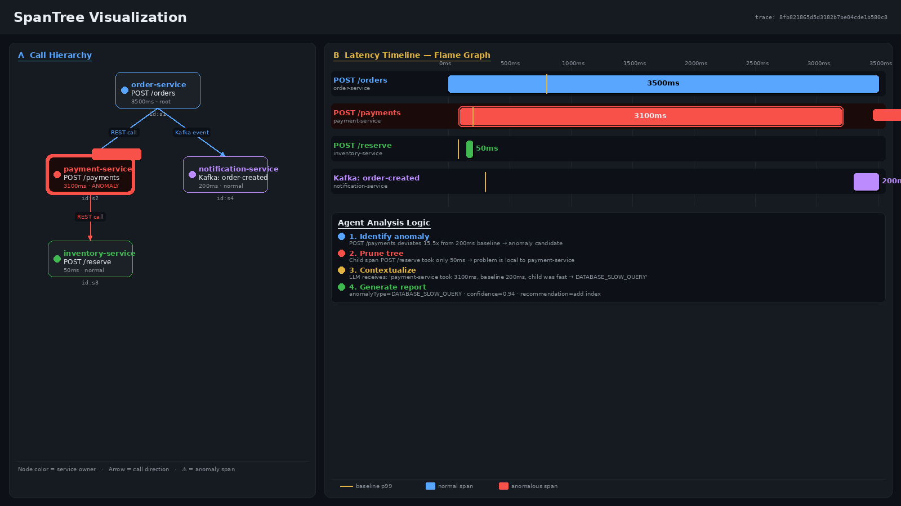

# RCA Agent 🤖

> An autonomous AI agent that diagnoses root causes of failures in distributed systems — analyzing OpenTelemetry traces and infrastructure metrics using a resilient hybrid LLM pipeline (Gemini Flash → Ollama fallback).

[](https://github.com/Mar10-Labs/rca-agent/actions)
[](https://openjdk.org/projects/jdk/21/)
[](https://kotlinlang.org/)
[](https://spring.io/projects/spring-boot)
[](https://github.com/langchain4j/langchain4j)

---

## What it does

When a microservice request goes slow or fails, finding the root cause across dozens of spans is tedious and slow. RCA Agent automates that entire workflow:

1. Receives a `traceId` via REST
2. Fetches the full span tree from Grafana Tempo
3. Enriches each span with historical baseline data from H2
4. Selects the optimal LLM and prompt strategy based on availability
5. Returns a structured JSON report: root cause, anomaly type, confidence score, and actionable recommendation

```
POST /api/analyze/{traceId}
→ { rootCause, anomalyType, confidence, recommendation, anomalyFactor }
```

---
## RCA Agent Architecture

This RCA Agent architecture features a hexagonal-based system that ingests telemetry from Kotlin services via an OTel/Prometheus/Tempo pipeline. 
It processes distributed traces and metrics through specialized adapters to analyze system health. Finally, it leverages a Hybrid LLM Layer 
(Gemini Flash as primary, Ollama Llama 3.2 as fallback) via LangChain4j to automate root cause diagnostics.



---


## Span Tree — Real Anomaly Example

The image outlines an agent analysis logic that identifies a 15.5x latency spike in POST /payments and prunes the trace tree after confirming child spans are fast. 
By contextualizing the 3100ms delay, an LLM diagnoses a DATABASE_SLOW_QUERY within the local service. It concludes by generating a report with 0.94 confidence, specifically recommending an index addition to resolve the anomaly.



---

## Stack

| Layer | Technology |
|---|---|
| Agent | Java 21, Spring Boot 3.3, LangChain4j |
| Microservices | Kotlin 2.0, Spring Boot 3.3 |
| Tracing | OpenTelemetry Java Agent, Grafana Tempo |
| Metrics | Prometheus, Grafana |
| Messaging | Apache Kafka |
| LLM (primary) | Google Gemini Flash |
| LLM (fallback) | Ollama llama3.2 (local, CPU) |
| Persistence | H2 in-memory |
| Resilience | Resilience4j — Circuit Breaker, Retry, Bulkhead, TimeLimiter |

---

## Quick Start

### Prerequisites

- Docker Desktop — **minimum 8GB RAM** (Settings → Resources → Memory → 8192 MB)
- Gemini API key (free tier): [aistudio.google.com/apikey](https://aistudio.google.com/apikey)

### 1. Configure environment

```bash
cp .env.example .env
# Set GEMINI_API_KEY in .env
# If left empty, the agent auto-degrades to Ollama mode
```

> ⚠️ Never commit `.env` — it is gitignored. `.env.example` must never contain real keys.

### 2. Start the stack

```bash
docker compose up -d
```

### 3. Run the demo

```bash
./scripts/demo.sh
```

The script injects an anomaly, fires a real order request, captures the `traceId` from the response, waits for Tempo to index the trace, calls the agent, and prints the RCA report.

| Scenario | Command | Description |
|---|---|---|
| Slow payment | `./scripts/demo.sh` | 3s latency injected in `payment-service` |
| Error storm | `./scripts/demo.sh errors` | 100% error rate on `payment-service` |
| Cascade failure | `./scripts/demo.sh cascade` | Latency + errors across multiple services |

---

## Demo Output

End-to-end execution of the cascade failure scenario — latency injected in `payment-service` + error rate in `inventory-service`:

```bash
./scripts/demo.sh cascade

═══════════════════════════════════════════════════
  RCA Agent Demo — scenario: cascade
═══════════════════════════════════════════════════
▶ Step 0: Waiting for RCA Agent to be ready...
 ✓ Ready

▶ Step 1: Injecting anomaly...
  ✓ payment-service: 3000ms latency injected
  ✓ inventory-service: 80% error rate injected

▶ Step 2: Firing request to order-service...
  HTTP/1.1 200
  {"orderId":"5acdca3e-1c15-4373-b2d6-9e1f43b10b1f","status":"FAILED","traceId":"215490281486b332bfabdcdfaef23eeb"}

  ✓ trace_id: 215490281486b332bfabdcdfaef23eeb

▶ Step 3: Waiting for Tempo to index trace...
  ✓ Trace indexed after 0 retries

▶ Step 4: Calling RCA agent...
{
  "traceId": "215490281486b332bfabdcdfaef23eeb",
  "rootCause": "The POST /orders in the order-service is failing due to high latency downstream",
  "anomalySpan": "POST /orders",
  "durationMs": 3313,
  "baselineMs": 250,
  "anomalyFactor": 13.252,
  "anomalyType": "HIGH_LATENCY_DOWNSTREAM",
  "recommendation": "Optimize the database connection to improve performance",
  "confidence": 0.8,
  "highConfidence": true,
  "anomaly": true
}

▶ Step 5: Resetting all anomaly injections...
  ✓ All injections reset

═══════════════════════════════════════════════════
  Demo complete — scenario: cascade
═══════════════════════════════════════════════════
```

---

## Manual Usage

```bash
TRACE_ID=$(curl -s -X POST http://localhost:8081/orders \
  -H "Content-Type: application/json" \
  -d '{"productId": "p1", "quantity": 2}' | jq -r '.traceId')

curl -s http://localhost:8080/api/analyze/$TRACE_ID | jq
```

```json
{
  "traceId": "4bf92f3577b34da6a3ce929d0e0e4736",
  "rootCause": "Slow SQL execution on payments table — full table scan detected",
  "anomalySpan": "db.query SELECT payments",
  "durationMs": 3980,
  "baselineMs": 45,
  "anomalyFactor": 88.4,
  "recommendation": "ANALYZE payments; add composite index on (order_id, status)",
  "confidence": 0.94
}
```

---

## AI Strategy & Resilience

### Hybrid Fallback Pipeline

```
Request → [Gemini Flash] ── success ──────────────────────→ RCA Report
                         └── quota / timeout / error ──→ [Ollama llama3.2] ── success → RCA Report
                                                                             └── fail ──→ Deterministic fallback report
```

1. **Dynamic Prompt Strategy** — two prompt variants optimized per model:
    - **Standard prompt** → Gemini: full span tree with OTel attributes, system metrics, multi-rule classification
    - **Lite prompt** → Ollama: minimal context designed for 1b parameter constraints

2. **Native JSON Mode** — Ollama is configured with `.format("json")` enforcing structured output at the inference level, not just as a prompt instruction

3. **Quota Circuit Breaker** — if Gemini returns a 429, the agent stops cloud calls for 60 seconds and routes exclusively to Ollama using an `AtomicLong` timestamp

### Resilience4j Patterns

| Pattern | Applied to | Configuration |
|---|---|---|
| Circuit Breaker | Tempo | Opens at 100% failure rate, recovers after 30s |
| Retry + Exponential Backoff | LLM | 3 attempts, 1s base, 2x multiplier |
| Bulkhead | LLM | Max 5 concurrent calls, 2s wait |
| TimeLimiter | Tempo / LLM | 5s / 60s hard timeout |

---

## Known Limitations

**Ollama 1b model** — at 1 billion parameters, `llama3.2:1b` has a strong prior toward `DATABASE_SLOW_QUERY` regardless of actual span data. This is a fundamental model capability constraint, not a prompt engineering problem. The lite prompt and JSON mode mitigate parse failures but cannot fix reasoning quality. For accurate multi-signal classification use `llama3.2:3b` or higher, or configure Gemini.

**LangChain4j Ollama client** — buffers the full response before returning. Streaming for structured outputs was not available at time of implementation, adding noticeable latency on CPU inference.

**Baseline cold start** — on first run with no history in H2, all services default to 200ms baseline. This may produce false positives for fast-completing spans until enough requests are processed.

**Tempo API** — the adapter uses `/api/traces/` (v1) which returns `batches[]`. `SpanTreeMapper` handles both `batches` and `resourceSpans` transparently. If your Tempo instance exposes `/api/v2/`, update the URI in `TempoTraceAdapter`.

---

## Observability URLs

| Tool | URL | Credentials |
|---|---|---|
| Grafana | http://localhost:3000 | admin / admin |
| RCA Agent API | http://localhost:8080/api/analyze/{traceId} | — |
| Prometheus | http://localhost:9090 | — |
| Tempo | http://localhost:3200 | — |

---

## Project Structure

```
rca-agent/
├── agent/                          # Java 21 — the RCA agent
│   └── src/main/java/com/rcaagent/
│       ├── adapters/in/            # REST controllers (inbound)
│       ├── adapters/out/           # Tempo, Prometheus, LLM, H2 (outbound)
│       ├── application/            # Use case orchestration
│       ├── domain/                 # Pure domain objects — no framework deps
│       ├── infrastructure/         # Spring config, health indicators
│       └── ports/                  # Port interfaces (in/out)
├── services/                       # Kotlin 2.0 microservices
│   ├── order-service/
│   ├── payment-service/
│   ├── inventory-service/
│   └── notification-service/
├── infra/                          # Tempo, Prometheus, Grafana, OTel config
├── scripts/
│   ├── demo.sh                     # End-to-end demo with anomaly injection
│   └── benchmark.sh                # Accuracy evaluation runner
└── docker-compose.yml
```

---

## Environment Variables

| Variable | Default | Description |
|---|---|---|
| `LLM_MODE` | `gemini` | `gemini` or `ollama` |
| `GEMINI_API_KEY` | _(empty)_ | Google AI Studio key — if empty, auto-routes to Ollama |
| `LLM_STANDARD_MODEL` | `gemini-1.5-flash` | Gemini model name |
| `LLM_LOCAL_MODEL` | `llama3.2:1b` | Ollama model name |
| `TEMPO_URL` | `http://tempo:3200` | Tempo base URL |
| `PROMETHEUS_URL` | `http://prometheus:9090` | Prometheus base URL |
| `OLLAMA_URL` | `http://ollama:11434` | Ollama base URL |
| `RCA_CONFIDENCE_THRESHOLD` | `0.75` | Minimum confidence for high-confidence flag |

---

*Built following SOLID principles and Hexagonal Architecture to demonstrate the viability of AI agents in platform engineering.*

**Mar10-Labs** — [GitHub](https://github.com/Mar10-Labs)
